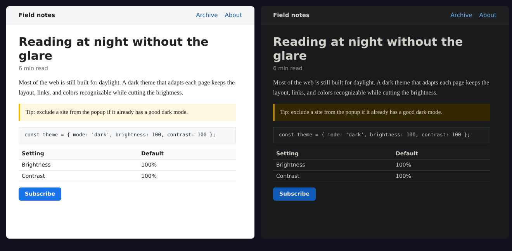
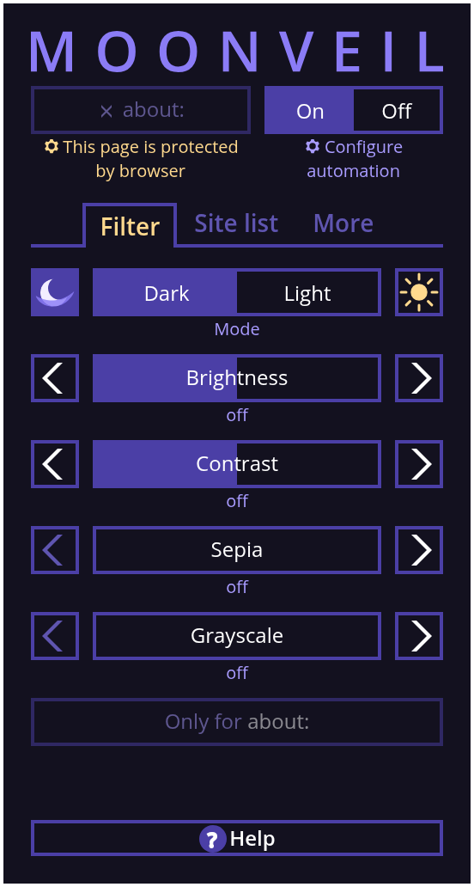

<p align="center">
  
</p>

<h1 align="center">Moonveil</h1>

<p align="center">Dark mode for every website. Open source, for Chrome, Edge, and Firefox.</p>

<p align="center">
  <a href="https://github.com/owenpkent/moonveil/actions/workflows/test.yml"></a>
  <a href="https://github.com/owenpkent/moonveil/actions/workflows/test-browser.yml"></a>
  <a href="LICENSE"></a>
</p>

<p align="center">
  
</p>

Moonveil generates a dark theme for each page as it loads: it reads the page's styles and remaps their colors, instead of simply inverting everything. Links, buttons, code blocks, and images stay recognizable while the brightness drops.

> **Status: early.** Moonveil 0.1.0 is not yet published to any extension store. You can build and load it yourself in a couple of minutes (see below).

## Features



- **Dynamic dark theme** that adapts each site's own colors, plus Filter, Filter+ and Static modes for sites where that works better.
- **Brightness, contrast, sepia, and grayscale** controls, globally or per site.
- **Site list and automation**: turn Moonveil on or off per site, or follow your system's dark mode or a schedule.
- **Thousands of site fixes** for popular websites, in an editable format with built-in developer tools.
- **Private by design**: no analytics, no accounts, no tracking. See [PRIVACY.md](PRIVACY.md).
- **Respects sites that opt out** with `<meta name="darkreader-lock">`, and sites that are already dark.

<br clear="right">

## Install from source

Requires [Node.js](https://nodejs.org/) 22 or newer.

```
git clone https://github.com/owenpkent/moonveil.git
cd moonveil
npm install
npm run wxt:build
```

- **Chrome or Edge:** open `chrome://extensions` (or `edge://extensions`), enable **Developer mode**, click **Load unpacked**, and choose `build/wxt/chrome-mv3` (or `build/wxt/edge-mv3`).
- **Firefox:** open `about:debugging#/runtime/this-firefox`, click **Load Temporary Add-on**, and choose `build/wxt/firefox-mv2/manifest.json`.

`npm run wxt:zip` creates store-ready zips. Build details are in [wxt/README.md](wxt/README.md).

## Roadmap

Moonveil's goal is a dark mode extension that is fast and unobtrusive:

- Less work per page on large, frequently changing sites
- No flash of light content while a page loads
- Better handling of canvas, video, and SVG content
- Minimal permissions, with per-site access as an option

The reasoning behind these priorities is in [docs/FEASIBILITY.md](docs/FEASIBILITY.md).

## Contributing

Bug reports, broken website reports, and pull requests are welcome, and so are AI-assisted contributions from people who understand and test what they submit. Start with [CONTRIBUTING.md](CONTRIBUTING.md). Questions and ideas go in [Discussions](https://github.com/owenpkent/moonveil/discussions). To report a security issue, see [SECURITY.md](SECURITY.md).

## Relationship to Dark Reader

Moonveil is a fork of [Dark Reader](https://github.com/darkreader/darkreader) by Dark Reader Ltd., used under the MIT license, and periodically merges its updates. It is an independent project, not affiliated with or endorsed by Dark Reader.

Differences so far:

- New name, icons, and interface colors
- No donation prompts, news feed, paid key activation, or promotion of other apps
- Built with [WXT](https://wxt.dev/) for Chrome, Edge, and Firefox from one codebase
- Fixes for bugs found in upstream code: solid light background images turning transparent, inline styles inside shadow roots not being themed, and pages opened in the background staying unthemed after being shown

Moonveil keeps Dark Reader's internal identifiers (such as `darkreader` CSS classes and `--darkreader-*` variables), so existing site fixes and sites that opt out with `darkreader-lock` keep working.

## License

Copyright (c) 2026 Owen Kent. Released under the [MIT License](LICENSE).

Moonveil includes code copyright Dark Reader Ltd., also MIT licensed. Bundled third-party components are listed in [THIRD_PARTY_NOTICES.md](THIRD_PARTY_NOTICES.md).
